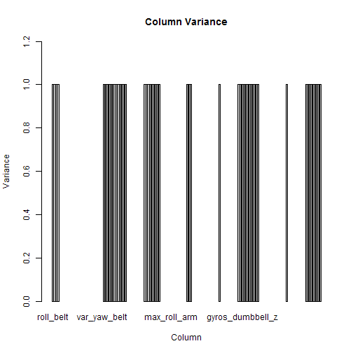
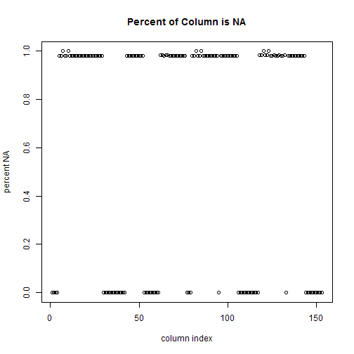
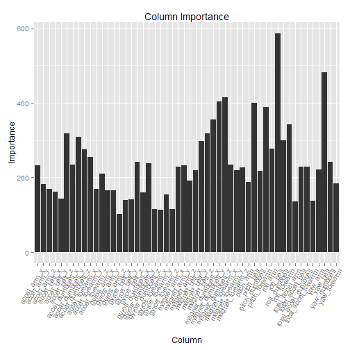
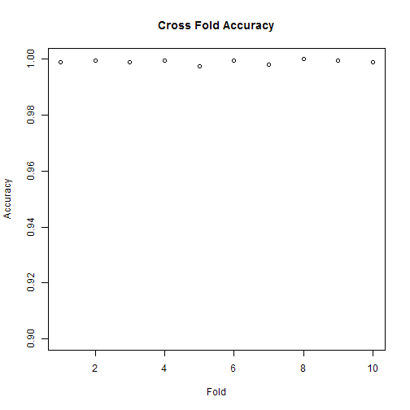

# JHU machine learning Mooc on Coursera

## Executive Summary

The objective of this analysis was to predict whether or not a user was doing a physical exercise correctly or not, based on sensor data. Using a random forest model on 52 of the available columns, I was able to predict the results with 99.9% accuracy.

## Data sources 

The training data used in this analysis are [available online](https://d396qusza40orc.cloudfront.net/predmachlearn/pml-training.csv]. [More information about the original project](http://groupware.les.inf.puc-rio.br/har) can be found online as well. Methods for downloading and loading the data can be found in `loaddata.R`.

## Exploratory Analysis

An intial view of the data made it obvious that there were a few fundamental problems. Details of this exploratory analysis can be found in `exploration3.R`.

### Useless Columns

First, some columns were unhelpful for predictions. These included:

- `X`, a row index
- `user_name`, the name of the subject performing the exercise
- `raw_timestamp_part_1`, a time of when the exercise was performed
- `raw_timestamp_part_2`, a time of when the exercise was performed
- `cvtd_timestamp`, a time of when the exercise was performed
- `new_window`, a time of when the exercise was performed
- `num_window", a time of when the exercise was performed

These columns were ignorned when building the model, as they didn't provide useful information that could be generalized to larger predictions.

### Zero Variance

Many of the remaning columns provided little to no variance and could be ignored in the model. For the sake of clarity in the plot below, I have scaled and centered the training data, then plotted the variance for each column on the y axis--clearly most columns do not provide adequate variation for prediction.

 

Columns with no variance were removed from the model. 

### Null values

Of the columns that still remained, a few were overwhelmingly null. Note that I treated the string "#DIV/O", an error string from Excel, as a null value. The figure below show the percentage of null values for each column. Columns that were 97% null were removed from the analysis.

 

## Model Generation

To create the model, I segmented the data into test and validation sets, using 80% of the 15699 observations in the training set, using caret's `createDataPartiton()` function, with `classe` as the outcome.

Then I trained the model using Random Forest with the following formula:

`classe ~ roll_belt + pitch_belt + yaw_belt + total_accel_belt + gyros_belt_x + 
    gyros_belt_y + gyros_belt_z + accel_belt_x + accel_belt_y + accel_belt_z +
    magnet_belt_x + magnet_belt_y + magnet_belt_z + roll_arm + pitch_arm + yaw_arm + 
    total_accel_arm + gyros_arm_x + gyros_arm_y + gyros_arm_z + accel_arm_x + 
    accel_arm_y + accel_arm_z + magnet_arm_x + magnet_arm_y + magnet_arm_z + 
    roll_dumbbell + pitch_dumbbell + yaw_dumbbell + total_accel_dumbbell + 
    gyros_dumbbell_x + gyros_dumbbell_y + gyros_dumbbell_z + accel_dumbbell_x + 
    accel_dumbbell_y + accel_dumbbell_z + magnet_dumbbell_x + magnet_dumbbell_y + 
    magnet_dumbbell_z + roll_forearm + pitch_forearm + yaw_forearm + total_accel_forearm + 
    gyros_forearm_x + gyros_forearm_y + gyros_forearm_z + accel_forearm_x + 
    accel_forearm_y + accel_forearm_z + magnet_forearm_x + magnet_forearm_y + 
    magnet_forearm_z, data = trainingsegment)`

The model predicted 99% of the training data accurately, and performed just as well on the validation data, using 52 variables. The figure below illustrates the importance of each.

 

Further detail about model creation is available in the `model.R` script.

## Cross Validation

In order to further validate my model, I tested it with 10-fold cross validation, creating 10 folds and testing the model's accuracy on each fold.

The overall prediction rate for each fold was over 99%, with an average accuracy of 99.903% and an average Kappa of 99.877%--see the plot below showing accuracy on the y axis (note that the y axis scale starts at 90%).

Given an average of 99.9% accuracy across 10 folds of 1962 entries each, we can safely assume that our out of sample error rate should be over 99%.

The code to perform this validation is available in `crossvalidation.R`.

 
